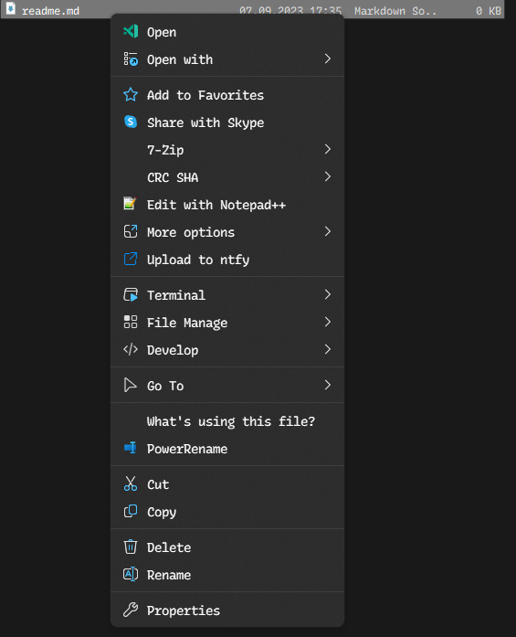

## How to use:
Add this your shell.nss or whereever you'd like it to be.

```item(type='file|dir|back.dir|drive' title='Upload to NTFY' image=[\uE0A4,#0092ff] cmd args='/K ntfy publish --file="@sel.file" server.com/topic "File: @sel.file" && @echo exit')```

For this to work you need to setup a default user and default password in your install directory of the NTFY CLI. If you don't want to use that, use the ``-u name:password`` flag instead.

It will look like this:



If you have any questions, add InvitedToHell on discord.